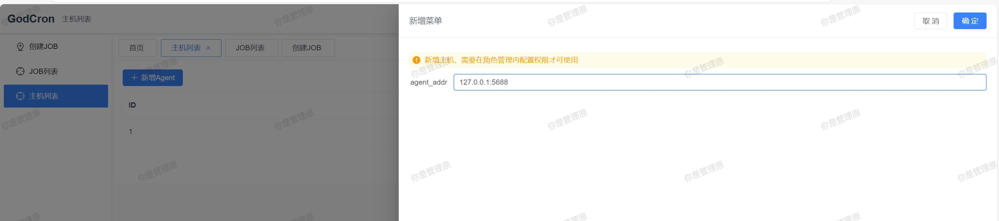
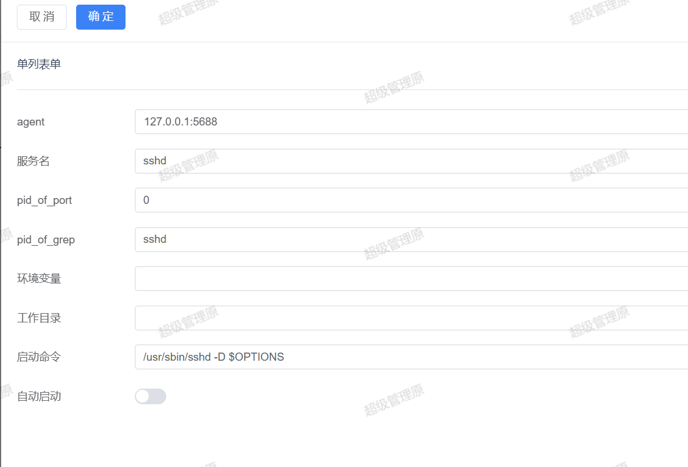
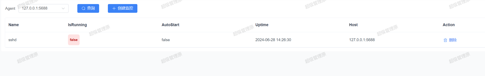

 
 

# GodCron
   
 
## 1. 基本介绍

### 1.1 项目介绍

> GodCron是一个分布式任务管理系统。
> 提供可视化界面便于管理各个主机的任务

测试用户名：admin

测试密码：admin123456

 
 

## 2. 使用说明

```
- node版本 > v16.8.3
- golang版本 >= v1.22
- IDE推荐：Goland
```

### 2.1 Agent


```bash
# 启动Agent
nohup ./godagent >/dev/null 2>&1 &

```

### 2.2 manager

```bash
# 启动Manager
nohup ./godcron >/dev/null 2>&1 &

#登录 web
http://127.0.0.1:6588
账号:admin
密码:admin123456

```

 

 
## 3. 技术选型

- 前端：用基于 [Vue](https://vuejs.org) 的 [Element](https://github.com/ElemeFE/element) 构建基础页面。
- 后端：用 [Gin](https://gin-gonic.com/) 快速搭建基础restful风格API，[Gin](https://gin-gonic.com/) 是一个go语言编写的Web框架。
- 数据库：采用`MySql` > (5.7) 版本 数据库引擎 InnoDB，使用 [gorm](http://gorm.cn) 实现对数据库的基本操作。
- 配置文件：使用 [fsnotify](https://github.com/fsnotify/fsnotify) 和 [viper](https://github.com/spf13/viper) 实现`yaml`格式的配置文件。
- 日志：使用 [zap](https://github.com/uber-go/zap) 实现日志记录。

## 4. 项目架构

#### 4.1 创建任务


#### 4.2 查看任务


#### 4.3 创建主机


#### 4.4 创建监控服务


#### 4.5 查看服务状态

 


## 5. 主要功能

- 任务调度：向主机创建任务。
- 任务查看：查询每个主机上的任务。

 
## 6.todo

6.1 添加任务日志查询

6.2 添加服务监控功能 
 

## 7. 联系方式
 
 

## 9. 捐赠


如果你觉得这个项目对你有帮助，你可以请作者喝饮料 


